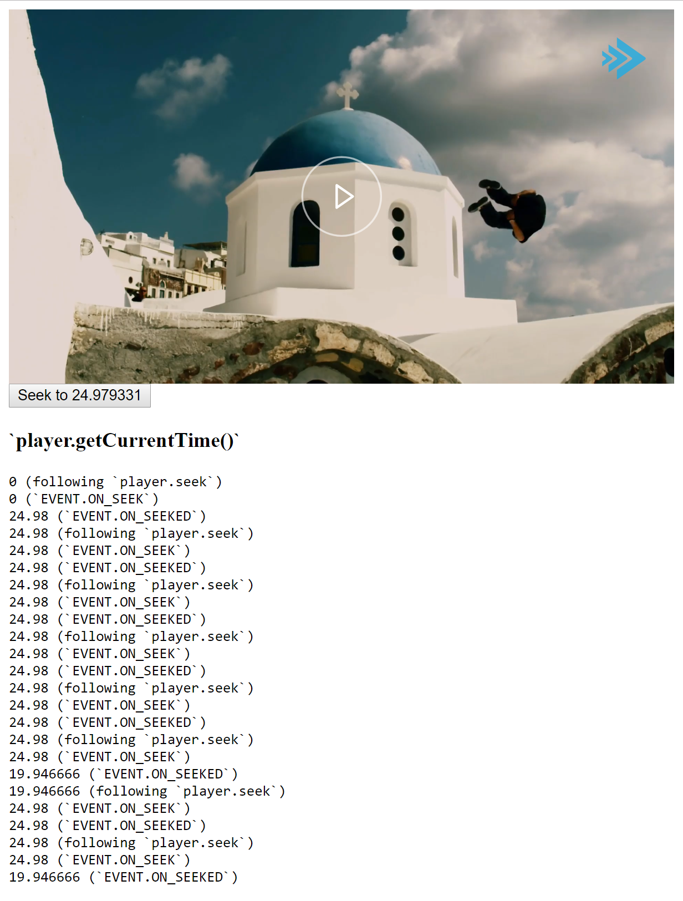

# Bitmovin Player seek issue

## Issue description

- When calling `player.seek(24.979331)` it sometimes jumps to `19.946666`
- Also discovered when making this example, calling `player.getCurrentTime()` from `EVENT.ON_SEEK` sometimes returns `0` – seems to happen for the initial call

Although I have included `player.getCurrentTime()` following `player.seek(…)` (i.e. not inside an event), I’m not sure if the time is correct at that point. Feel free to ignore that value.

I can add that clicking the button eight times before doing a refresh most of the times gives incorrect results similar to what is shown in the two example runs. During the example runs, I clicked the button with approximately a half second between each click.

## Setup

    git clone https://github.com/alexanderte/bitmovin-player-seek-issue
    cd bitmovin-player-seek-issue
    yarn
    node index.js

Then open http://localhost:3000

## Example run 1

## Example run 2

## Example run 3

